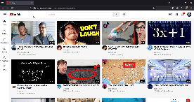

# HTML-CSS-YouTube

In this project, I'm practicing my skills in HTML and CSS by creating a simple version of the YouTube.com interface.

## Project Structure

- **youtube.html**: The main file to run the project.
- **Icons**: Contains all the icons used in the project.
- **images**: Contains all the images used in the project.
- **styles**: Contains all the CSS files used in the project.

## Usage

To use this project, simply open the `youtube.html` file in any web browser. Ensure that the file structure remains the same, with all folders and files in their current locations.

## Open Source

This project is open source. Feel free to modify and improve it as you see fit.

## Author

Hicham Bourezi
<hicham.bourezi@gmail.com>